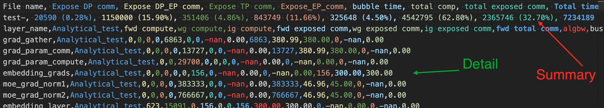
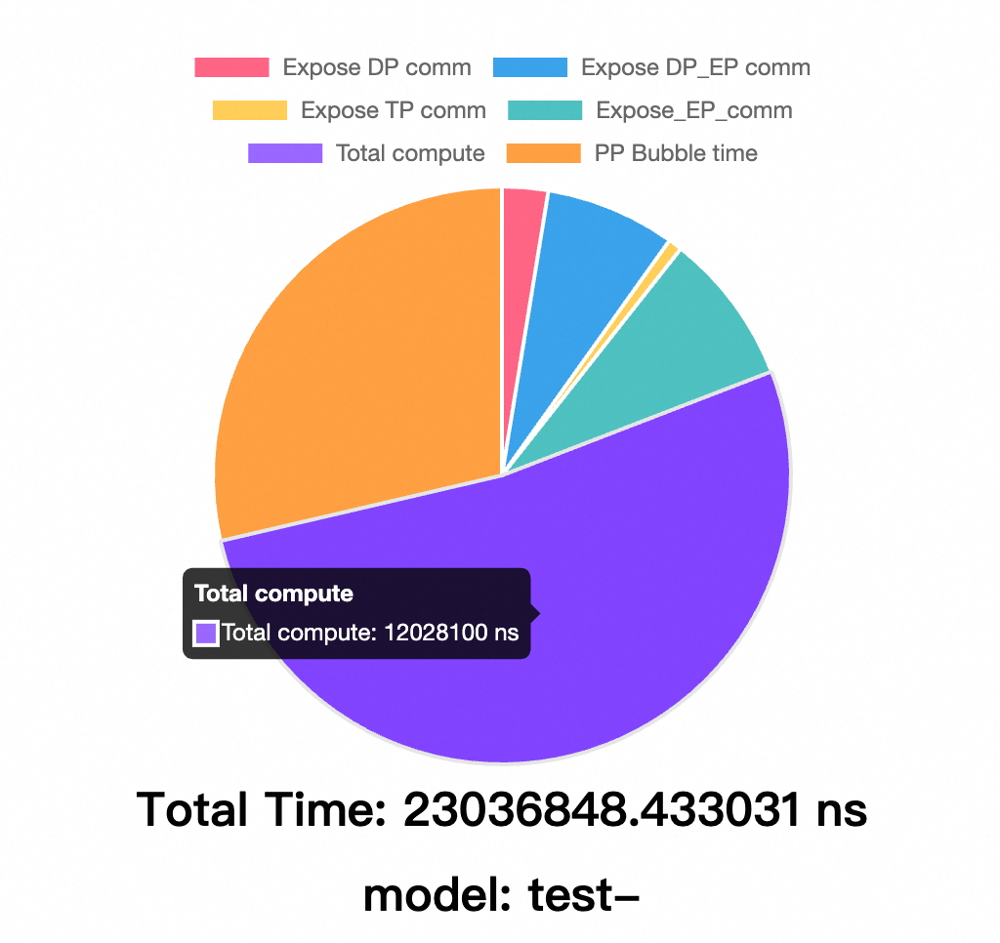
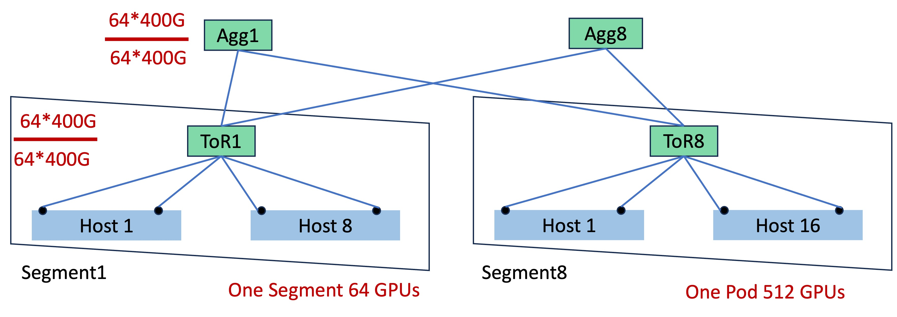
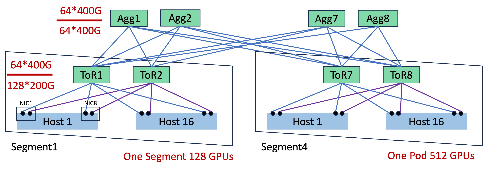
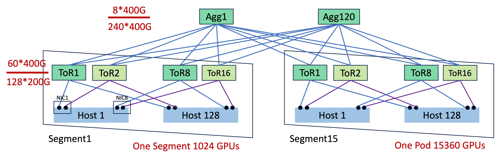
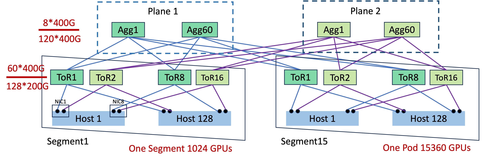
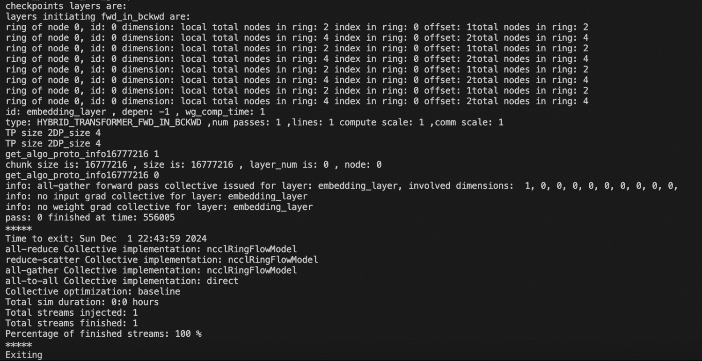

# 🌟 简介

SimAI 是一个综合性大规模AI训练模拟工具包，提供三大模拟场景：

1. **SimAI-Analytical** - 基于解析的模拟工具，通过抽象底层网络通信细节实现快速场景验证。采用简化的busbw（总线带宽）估算集合通信/点对点通信时间，主要应用场景包括：

    * *性能分析*：对比不同模型的完成时间（如研究专家数量对MoE模型训练性能的影响）
    * *框架级并行参数优化*：平衡优化TP/EP/PP参数分析端到端时序影响
    * *规模扩展探索*：研究特定场景优化的规模扩展域内并行参数性能
    * *规模扩展带宽选择*：研究不同GPU性能的成本效益带宽配置

> 💡 *当前支持手动busbw.yaml配置。基于并行场景的自动busbw推理功能即将开源，详情请联系我们。✨*

2. **SimAI-Simulation(NS-3)** - 高保真全栈模拟工具，可理论集成任何纯网络模拟器。提供LLM训练期间通信行为的细粒度复现，当前支持NS-3作为网络后端（鼓励集成新网络模拟工具）。重点研究领域：
    * *集合通信算法研究*：设计优化非交换架构及新兴网络拓扑的集合通信流量模式
    * *网络协议研究*：评估优化不同架构下的网络协议、拥塞控制算法、路由机制等底层网络技术
    * *新型网络架构设计*：探索创新网络架构

> 💡 我们强烈建议研究人员在此基础上进行创新扩展和突破性研究（适合顶会级别）。加入社区或通过邮件联系我们，我们将为有潜力的研究方向提供技术支持！✨

3. **SimAI-Physical(TODO)**

各组件详细功能请参考 [SimCCL](https://github.com/aliyun/SimCCL ) 和 [ns-3-alibabacloud](https://github.com/aliyun/ns-3-alibabacloud )

# 🛠️ 环境搭建

正常运行SimAI需要使用[AICB](https://github.com/aliyun/aicb?tab=readme-ov-file#generate-workloads-for-simulation-simai )工具生成Workload文件。创建精确Workload可能需要使用AIOB功能确定各类计算内核时序，这需要GPU环境。因此推荐在最新**NGC镜像**中直接执行SimAI全栈工具包。

> 💡 **重要提示**：SimAI-Simulation编译需要移除预装的ninja（NVIDIA系统默认安装），可用以下命令卸载：
> ```bash
> apt remove ninja-build && pip uninstall ninja
> ```

构建说明：

```bash
# 克隆仓库
$ git clone https://github.com/aliyun/SimAI.git 
$ cd ./SimAI/

# 克隆子模块
$ git submodule update --init --recursive
# 确保使用最新提交
$ git submodule update --remote

# 编译SimAI-Analytical
$ ./scripts/build.sh -c analytical

# 编译SimAI-Simulation (ns3)
$ ./scripts/build.sh -c ns3
```

# 🌐 SimAI-Analytical 使用指南
## 📝 工作负载生成

使用[AICB](https://github.com/aliyun/aicb )的[SimAI-WorkloadGenerator](https://github.com/aliyun/aicb?tab=readme-ov-file#generate-workloads-for-simulation-simai )功能生成模拟工作负载。将生成类似[workload_analytical.txt](../example/workload_analytical.txt)的`.txt`文件，包含：

- `model_parallel_NPU_group`: Tensor并行规模
- `ep`: 专家模型并行规模
- `pp`: 流水线模型并行规模
- `vpp`: 虚拟流水线并行（默认：`--num-layers-per-virtual-pipeline-stage=1`最小PP气泡）

> 💡 *详情请参考[AICB workload教程](https://github.com/aliyun/aicb/blob/master/training/tutorial.md#workload )*

## 🔧 总线带宽设置

SimAI-Analytical通过直接指定busbw抽象底层网络细节估算集合通信时间。自定义各场景通信busbw可使用[busbw.yaml](../example/busbw.yaml)文件，格式如下：

```yaml
test
TP:
  allreduce,: 300      # TP场景AllReduce带宽300GB/s
  allgather,: 280
  reducescatter,: 280
  alltoall,: 230
DP:
  allreduce,: null
  allgather,: 380      # DP场景AllGather带宽380GB/s
  reducescatter,: 380
  alltoall,: null
EP:
  allreduce,: null
  allgather,: 45       # DP_EP场景AllGather带宽45GB/s
  reducescatter,: 45   # DP_EP场景ReduceScatter带宽45GB/s
  alltoall,: 80        # EP场景AlltoAll带宽80GB/s
```
> 🔍 *需要自动化busbw计算（考虑集群规模、架构、并行参数、小消息调整和延迟）？欢迎讨论交流！✨*

## 🖥️ 解析模拟

运行解析模拟命令：

```bash
$ ./bin/SimAI_analytical -w example/workload_analytical.txt -g 9216 -g_p_s 8 -r test- -busbw example/busbw.yaml
```

### 必需参数

| 参数 | 长格式 | 描述 |
|:---------:|:----------|:------------|
| `-w` | `--workload` | 指定工作负载文件路径 |
| `-g` | `--gpus` | 指定模拟GPU规模 |
| `-g_p_s` | `--gpus-per-server` | 指定单机GPU规模 |
| `-r` | `--result` | 指定输出文件路径前缀（默认：`./results/`）<br>推荐包含模拟参数，例如：<br>`A100-llama405b-tp8-pp16-dp128-ga16-ep1-NVL8` |
| `-busbw` | `--bus-bandwidth` | 指定busbw文件路径<br>（推荐直接修改`example/busbw.yaml`） |

### 可选参数

| 参数 | 长格式 | 描述 |
|:---------:|:----------|:------------|
| `-v` | `--visual` | 是否生成可视化文件 |

### 通信组重叠比例

以下参数指定通信组重叠比例（默认0表示无重叠）：

| 参数 | 长格式 | 描述 | 范围 |
|:---------:|:----------|:------------|:------|
| `-dp_o` | `--dp-overlap-ratio` | DP重叠比例 | [0.0-1.0] |
| `-ep_o` | `--ep-overlap-ratio` | EP重叠比例 | [0.0-1.0] |
| `-tp_o` | `--tp-overlap-ratio` | TP重叠比例 | [0.0-1.0] |
| `-pp_o` | `--pp-overlap-ratio` | PP重叠比例 | [0.0-1.0] |

> 📝 *由于重叠策略多样且场景依赖，我们优先采用简单高效方法直接指定重叠条件。*

## 结果分析

### 原始数据

正常运行SimAI-Analytical将生成CSV输出，第二行为摘要信息，包含暴露时间、各通信组计算时间绝对值/百分比及单次迭代端到端时间，下方为各层具体操作细节。



### 可视化

若运行时指定`-v`参数将生成：



# SimAI-Simulation 使用指南
## 📝 工作负载生成

与SimAI-Analytical相同，使用[AICB](https://github.com/aliyun/aicb )的[SimAI-WorkloadGenerator](https://github.com/aliyun/aicb?tab=readme-ov-file#generate-workloads-for-simulation-simai )功能生成。

## 🔧 网络拓扑设置
运行SimAI-Simulator前需要生成ns-3-alibabacloud可识别的拓扑文件。
### 拓扑模板
为提升便捷性，我们提供5种常见架构模板（Spectrum-X、单平面AlibabaHPN、双平面AlibabaHPN和DCN+），通过`-topo`参数设置。这些图示概览如下。若需了解双ToR和双平面区别，请阅读[HPN 7.0论文](https://ennanzhai.github.io/pub/sigcomm24-hpn.pdf )
<table>
  <tr>
    <td><br><p>Spectrum-X(单Pod)</p></td>
  </tr>
  <tr>
    <td><br><p>DCN+单ToR(单Pod)</p></td>
    <td><br><p>DCN+双ToR(单Pod)</p></td>    
  </tr>
  <tr>
    <td><br><p>AlibabaHPN单平面(单Pod)</p></td>
    <td><br><p>AlibabaHPN双平面(单Pod)</p></td>
    
  </tr>
</table>

以下命令生成图示8GPU的Spectrum-X拓扑：
```bash
python3 ./astra-sim-alibabacloud/inputs/topo/gen_Topo_Template.py -topo Spectrum-X -g 8 -psn 1
```


下表给出各层级参数描述及各模板默认参数。用户可通过更改`-topo`名称和对应`-g`参数生成对应结构拓扑。（未指定GPU数时将生成各模板单Pod拓扑，目前暂不支持多Pod）

| 参数层级 | 参数  | 描述 |
|-----------------|------------|-------------|
| 整体结构 | `-topo`    | 拓扑模板 |
|          | `-g`       | GPU数量 |
|          | `--dp`     | 启用双平面（默认单平面） |
|          | `--ro`     | 启用Rail-Optimized |
|          | `--dt`     | 启用双网卡双ToR |
|          | `-er`      | 错误率 |
| 主机内   | `-gps`     | 每服务器GPU数 |
|          | `-gt`      | GPU类型 |
|          | `-nsps`    | 每服务器NV交换机数 |
|          | `-nvbw`    | NVLink带宽 |
|          | `-nl`      | NVLink延迟 |
|          | `-l`       | 网卡延迟 |
| 分段内   | `-bw`      | 网卡到ASW带宽 |
|          | `-asw`     | ASW交换机数 |
|          | `-nps`     | 每交换机网卡数（ASW连接GPU数） |
| Pod内    | `-psn`     | PSW交换机数 |
|          | `-apbw`    | ASW到PSW带宽 |
|          | `-app`     | 每PSW连接ASW数 |

| 参数层级 | 参数  | Spectrum-X  | AlibabaHPN单平面 | AlibabaHPN双平面 | DCN+双平面 | DCN+单平面 |
|-----------------|------------|-------------|-------------------------|-----------------------|---------------|---------------|
| 整体结构 | `-topo`    | `Spectrum-X`| `AlibabaHPN`            | `AlibabaHPN`          | `DCN+`        | `DCN+`        |
|          | `-g`       | 4096        | 15360                   | 15360                 | 512           | 512           |
|          | `--dp`     | false       | false                   | true                  | false         | false         |
|          | `--ro`     | true        | true                    | true                  | false         | false         |
|          | `--dt`     | false       | true                    | true                  | true          | false         |
|          | `-er`      | 0           | 0                       | 0                     | 0             | 0             |
| 主机内   | `-gps`     | 8           | 8                       | 8                     | 8             | 8             |
|          | `-gt`      | H100        | H100                    | H100                  | H100          | A100          |
|          | `-nsps`    | 1           | 1                       | 1                     | 1             | 1             |
|          | `-nvbw`    | 2880Gbps    | 2880Gbps                | 2880Gbps              | 2880Gbps      | 2880Gbps      |
|          | `-nl`      | 0.000025ms  | 0.000025ms              | 0.000025ms            | 0.000025ms    | 0.000025ms    |
|          | `-l`       | 0.0005ms    | 0.0005ms                | 0.0005ms              | 0.0005ms      | 0.0005ms      |
| 分段内   | `-bw`      | 400Gbps     | 200Gbps                 | 200Gbps               | 200Gbps       | 400Gbps       |
|          | `-asw`     | 64          | 120                     | 120                   | 2             | 1             |
|          | `-nps`     | 64          | 128                     | 128                   | 128           | 64            |
| Pod内    | `-psn`     | 64          | 120                     | 120                   | 8             | 4             |
|          | `-apbw`    | 400Gbps     | 400Gbps                 | 400Gbps               | 400Gbps       | 400Gbps       |
|          | `-app`     | 64          | 240                     | 120                   | 8             | 4             |

通过不同`-topo`名称和参数可生成各模板拓扑：
双平面AlibabaHPN（64GPU，16asn，16psn）：
```bash
python3 ./astra-sim-alibabacloud/inputs/topo/gen_Topo_Template.py -topo AlibabaHPN --dp -g 64 -asn 16 -psn 16
```
双ToR DCN（128GPU，2asn，8psn）：
```bash
python3 ./astra-sim-alibabacloud/inputs/topo/gen_Topo_Template.py -topo DCN+ --dt -g 128 -asn 2 -psn 8
```
注意：Spectrum-X不支持`--ro` `--dt` `--dp`（固定为Rail-Optimized单ToR单平面），AlibabaHPN不支持`--ro` `--dt`（固定为Rail-Optimized双平面/单平面），DCN+不支持`--ro` `--dp`（固定为单ToR/双ToR）。

用户可自定义拓扑，例如构造32GPU、200Gbps带宽、A100、8psn的Rail-Optimized单ToR拓扑：
```bash
python3 ./astra-sim-alibabacloud/inputs/topo/gen_Topo_Template.py -g 32 -bw 200Gbps -gt A100 -psn 8 --ro
```

## 🖥️ SimAI-NS3 模拟

```bash
$ AS_SEND_LAT=3 AS_NVLS_ENABLE=1 ./bin/SimAI_simulator -t 16 -w ./example/microAllReduce.txt -n  ./Spectrum-X_8g_8gps_400Gbps_H100  -c astra-sim-alibabacloud/inputs/config/SimAI.conf
```

| 环境变量名 | 描述                      | 默认值                             |
|---------------------------|----------------------------------|-------------------------------------------|
| `AS_LOG_LEVEL`            | 日志等级                        | `DEBUG`, `INFO`, `WARNING`, `ERROR`, `UNKNOWN`; 默认 `INFO` |
| `AS_PXN_ENABLE`           | 启用PXN                       | `0/1`; 默认 `false`                 |
| `AS_NVLS_ENABLE`          | 启用NVLS                      | `0/1`; 默认 `false`                 |
| `AS_SEND_LAT`             | 设置包发送延迟       | 默认 `6`，单位 `us`              |
| `AS_NVLSTREE_ENABLE`      | 启用NVLSTREE                  | 默认 `false`                        |

| 参数                  | 描述                              | 默认值                                                      |
|----------------------------|------------------------------------------|--------------------------------------------------------------------|
| `-t  --thread`            | 多线程加速线程数 | 默认 `1`; 启用多线程时控制在 `8` 到 `16` 之间 |
| `-w  --workload`          | 工作负载路径                         | `./microAllReduce.txt`                                             |
| `-n  --network-topo`      | 网络拓扑路径                    | None    

## RING VS NVLS
### workload
```bash
HYBRID_TRANSFORMER_FWD_IN_BCKWD model_parallel_NPU_group: 8 ep: 1 pp: 1 vpp: 8 ga: 1 all_gpus: 32 checkpoints: 0 checkpoint_initiates: 0
6
embedding_layer     -1 556000  ALLREDUCE   16777216      1       NONE 0        1      NONE   0      1 
...
```
### NVLS拓扑文件 && 运行
```bash
cd SimAI
./scripts/build.sh -c ns3
python3 ./astra-sim-alibabacloud/inputs/topo/gen_Topo_Template.py --ro -g 32 -gt H100 -bw 400Gbps -nvbw 1360Gbps 
AS_SEND_LAT=12 AS_NVLS_ENABLE=1 ./bin/SimAI_simulator -t 8 -w ./example/microAllReduce.txt -n ./Rail_Opti_SingleToR_32g_8gps_400Gbps_H100 -c ./astra-sim-alibabacloud/inputs/config/SimAI.conf
```
### RING拓扑文件 && 运行
```bash
python3 ./astra-sim-alibabacloud/inputs/topo/gen_Topo_Template.py --ro -g 32 -gt H100 -bw 400Gbps -nvbw 1440Gbps
AS_SEND_LAT=2 AS_PXN_ENABLE=1 ./bin/SimAI_simulator -t 8 -w ./example/microAllReduce.txt -n ./Rail_Opti_SingleToR_32g_8gps_400Gbps_H100 -c ./astra-sim-alibabacloud/inputs/config/SimAI.conf
```
### 结果
| 消息大小 | NVLS   | RING   |
|----------|--------|--------|
| 16M      | 148.88 | 141.84 |
| 32M      | 178.04 | 153.68 |
| 64M      | 197.38 | 160.60 |
| 128M     | 208.70 | 163.85 |
| 256M     | 214.87 | 165.72 |
| 512M     | 218.09 | 166.68 |


## Spectrum-X架构 VS DCN+架构
### workload
```bash
HYBRID_TRANSFORMER_FWD_IN_BCKWD model_parallel_NPU_group: 8 ep: 1 pp: 1 vpp: 8 ga: 1 all_gpus: 256 checkpoints: 0 checkpoint_initiates: 0
1
embedding_layer     -1 556000         NONE 0        1      NONE   0      1 ALLREDUCE   536870912      1
```
### 网络拓扑文件
```bash
# DCN+拓扑文件 (单ToR, 非Rail-Optimized)
python3 ./astra-sim-alibabacloud/inputs/topo/gen_Topo_Template.py -topo DCN+ -g 256 -psn 64 -bw 400Gbps 
# Spectrum拓扑文件 (单ToR, Rail-Optimized)
python3 ./astra-sim-alibabacloud/inputs/topo/gen_Topo_Template.py -topo Spectrum-X -g 256
```
### 运行命令
```bash
# DCN+运行命令
AS_SEND_LAT=2 ./bin/SimAI_simulator -t 8 -w ./example/microAllReduce.txt -n ./DCN+SingleToR_256g_8gps_400Gbps_H100 -c ./astra-sim-alibabacloud/inputs/config/SimAI.conf
# HPN7.0运行命令
AS_SEND_LAT=2 ./bin/SimAI_simulator -t 8 -w ./example/microAllReduce.txt -n ./Spectrum-X_256g_8gps_400Gbps_H100 -c ./astra-sim-alibabacloud/inputs/config/SimAI.conf
```
| 消息大小 | Spectrum-X  | DCN-单ToR|
|----------|-------------|--------------|
| 16M      | 33.095585   | 23.332048    |
| 32M      | 38.572166   | 25.762846    |
| 64M      | 42.049648   | 23.677116    |
| 128M     | 44.036110   | 35.209461    |
| 256M     | 45.101425   | 36.205692    |
| 512M     | 45.653648   | 36.242008    |

# SimAI-Physical 使用指南
当前模拟器兼容ns3离散事件模拟器作为网络后端，以及物理网络后端用于物理包注入。

## 编译
SimAI-Phy当前使用roceV2协议进行流量生成。编译需要依赖RDMA物理设备相关的libverbs及MPI程序。编译前请验证环境能否成功运行基础RDMA perfetest流量生成工具并支持相关MPI程序。
```bash
# 克隆仓库
$ git clone https://github.com/aliyun/SimAI.git 
$ cd ./SimAI/

# 克隆子模块
$ git submodule update --init --recursive
# 确保使用最新提交
$ git submodule update --remote

# 编译SimAI-Analytical
$ ./scripts/build.sh -c analytical

# 编译SimAI-Simulation (ns3)
$ ./scripts/build.sh -c ns3

# 编译SimAI-phynet (phynet)
$ sudo yum install openmpi openmpi-devel
$ export MPI_INCLUDE_PATH=/usr/include/openmpi-x86_64/ 
$ export MPI_BIN_PATH=/usr/lib64/openmpi/bin/mpic++	
$ ./scripts/build.sh -c Phy
```
## 工作负载生成
SimAI-Phy物理流量生成所需工作负载与Sim-Simulation相同，通过AICB生成。

### 示例工作负载
```bash
HYBRID_TRANSFORMER_FWD_IN_BCKWD model_parallel_NPU_group: 2 ep: 1 pp: 1 vpp: 8 ga: 1 all_gpus: 2 checkpoints: 0 checkpoint_initiates: 0
10
mlp_norm    	    -1	1055000	 ALLGATHER	  1073741824	1055000	      NONE	         0	1055000	      NONE	         0	       100
...
```
## 准备主机列表
主要任务是准备启动MPI程序所需的IP列表，这与nccl-test不同。这里的IP数量应与参与物理流量生成的实际网卡数量匹配，而非参与物理流量生成的节点数量。
```bash
33.255.199.130
33.255.199.129
```
## 运行
### MPI运行
```bash 
/usr/lib64/openmpi/bin/mpirun -np 2 -host 33.255.199.130,33.255.199.129 --allow-run-as-root -x AS_LOG_LEVEL=0  ./bin/SimAI_phynet ./hostlist -g 2 -w ./example/microAllReduce.txt
```
以下输出表明程序已运行完成。



## MPI程序参数设置

| 参数        | 描述                                           | 默认值 |
|------------------|-------------------------------------------------------|---------------|
| -np              | 进程数                              | NULL          |
| -host            | IP列表                                               | NULL          |
| --allow-run-as-root | 允许MPI程序以root权限运行      | FALSE         |
## SimAI-phynet参数设置

| 参数        | 描述                  | 默认值                                           |
|------------------|------------------------------|----------------------------------------------------------|
| hostlist         | 主机IP列表                 | NULL                                                     |
| -w --workload    | 工作负载路径             | ./microAllReduce.txt                                     |
| -i --gid_index   | 网络拓扑路径        | 0                                                        |
| -g --gpus        | GPU数量               | 8 (应与主机IP列表中的IP数一致) |